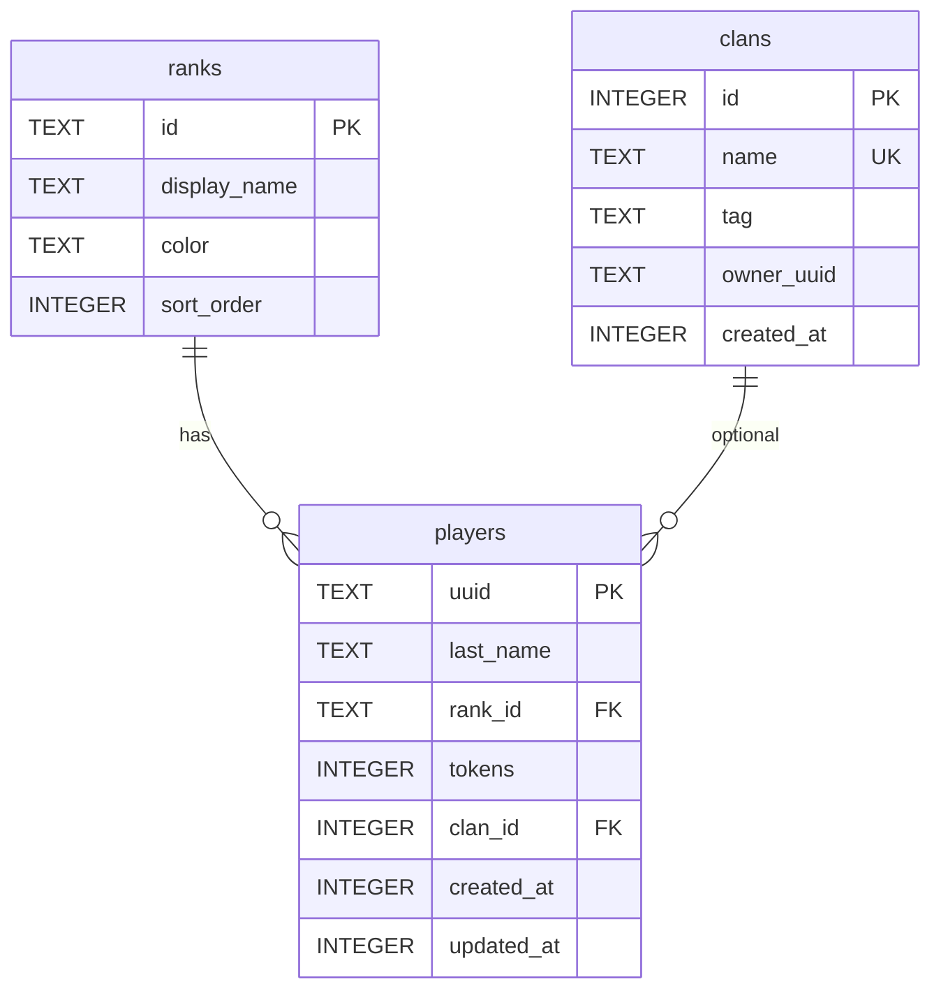

# Модель БД PveAuction (`plugins/PveAuction/pve.db`)

SQLite, один файл на профили игроков, кланы и (отдельно) `auctions.db` для лотов.

## ER-диаграмма



## Таблицы

### `ranks` — справочник рангов

| Колонка       | Тип  | Описание                          |
|---------------|------|-----------------------------------|
| `id`          | TEXT | PK, например `player`, `vip`      |
| `display_name`| TEXT | То, что в скобках: `Игрок`        |
| `color`       | TEXT | Цвет ранга: `GREEN`, `RED`, `GOLD`… (Adventure) |
| `sort_order`  | INT  | Сортировка в будущем              |

Стартовая запись: `player` → **Игрок**, цвет **GREEN**.

Пример VIP-ранга:
```sql
INSERT INTO ranks (id, display_name, color, sort_order)
VALUES ('vip', 'VIP', 'GOLD', 10);
UPDATE players SET rank_id = 'vip' WHERE uuid = '...';
```

### `clans` — кланы

| Колонка      | Тип  | Описание              |
|--------------|------|-----------------------|
| `id`         | INT  | PK AUTOINCREMENT      |
| `name`       | TEXT | UNIQUE, название      |
| `tag`        | TEXT | Короткий тег (опц.)   |
| `owner_uuid` | TEXT | UUID лидера           |
| `created_at` | INT  | Unix ms               |

### `players` — профиль игрока

| Колонка      | Тип  | Описание                              |
|--------------|------|---------------------------------------|
| `uuid`       | TEXT | PK, UUID игрока                       |
| `last_name`  | TEXT | Последний ник                         |
| `rank_id`    | TEXT | FK → `ranks.id`, по умолчанию `player`|
| `tokens`     | INT  | Токены (внутр. валюта)                 |
| `clan_id`    | INT  | FK → `clans.id`, NULL = без клана     |
| `created_at` | INT  | Unix ms                               |
| `updated_at` | INT  | Unix ms                               |

**Монеты** в БД не хранятся — берутся из Vault/Essentials при показе скорборда.

## Примеры

**Игрок без клана:**
```
uuid: 550e8400-e29b-41d4-a716-446655440000
rank_id: player  →  [Игрок] (зелёный)
tokens: 0
clan_id: NULL     →  «не состоит в клане»
```

**Игрок в клане:**
```
clan_id: 3  →  clans.name = «Драконы»
tokens: 150
```

## Файлы на диске

| Файл           | Содержимое        |
|----------------|-------------------|
| `pve.db`       | players, clans, ranks |
| `auctions.db`  | lots (аукцион)    |
